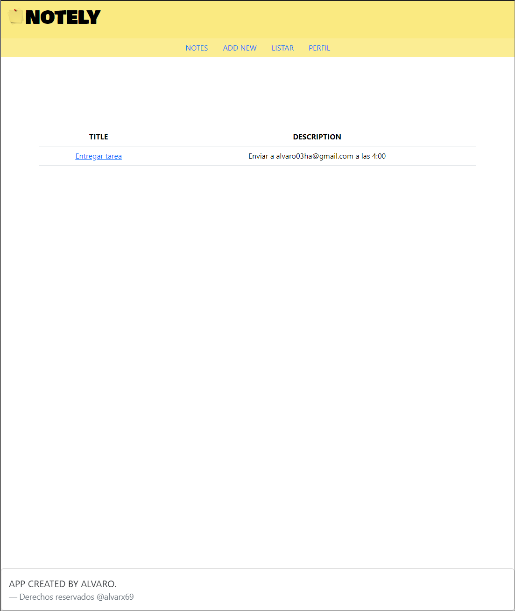

## SOBRE NOTELY

Es una aplicacion para crear notas y organizar tu dia.
Es una aplicacion monolitica desarrollada en laravel, usa el login de la clase Auth. 
El sistema gestor de bases de datos es MySql.
El front-End esta desarrollado con el sistema de vistas de laravel y bootsrap.

## FOTO DE LA APP

